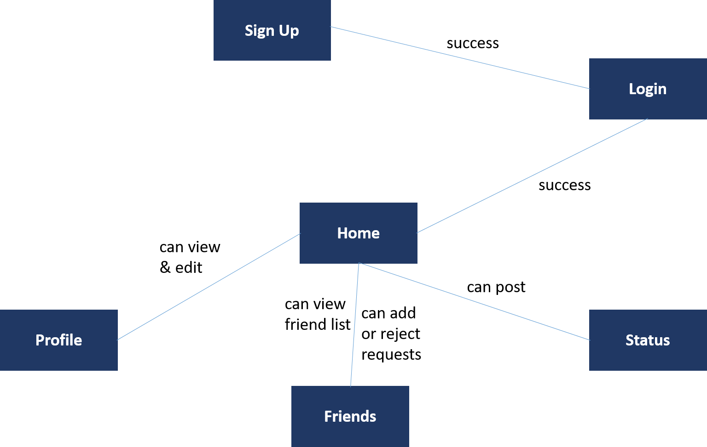

## Project Documentation
+ Project Documentation is provided below.

## Features
+ User
    + Mandatory Registration to access the site
    + Login (For Registered Users)
    + Logout (For Registered Users)
    + Edit Profile (For Registered Users)
      + username
      + real name
      + valid email address
      + phone number
      + image
  
+ Admin
    + CRUD Operations
    
+ User Profile
    + Edit Profile
    + Reset Password  

+ Friendships
    + Friend List
    + Sent Request List
    + Received Request List
    + Delete friend from friend list
    + Accepting friend request will update both parties friend list
    + Users can search other users and send friend request 
    

    
## Pages and navigation

## Technological considerations

+ Django 2.1
+ Python 3.7
+ Bootstrap 4
+ Heroku
+ PostgreSQL 11

### Django apps in your Django project
+ Home
+ User
+ Friends
+ Timeline

### Needed Django models and their attributes
+ User Model
+ User Profile Model
+ Friends Model
+ FriendRequests Model
+ Post Model

### URIs
Completed URLS:

    urlpatterns = [
    path('admin/', admin.site.urls),
    path('register/', user_views.register, name='register'),
    path('profile/', user_views.profile, name='profile'),
    path('login/', auth_views.LoginView.as_view(template_name='user/login.html'), name='login'),
    path('logout/', auth_views.LogoutView.as_view(template_name='user/logout.html'), name='logout'),
    path('timeline/', timeline_views.timeline, name='timeline_status'),
    path('post/new/', PostCreateView.as_view(), name='post-create'),
    path('post/<int:pk>/', PostDetailView.as_view(), name='post-detail'),
    path('view_profile/<int:pk>/', user_views.view_profile, name="view_profile"),
    path('view_profile2/<int:pk>/', user_views.view_profile2, name="view_profile2"),
    path('view_profile_full/<int:pk>/', user_views.view_profile_full, name="view_profile_full"),
    path('', include('home.urls')),
    path('', include('friends.urls')),
    path('friends/', views.timeline_friends, name='tfriends'),
    path('findfriends/', views.timeline_find_friends, name='ffriends'),
    path('friends/add/', views.friend_request_list, name='friendship_request_list'),
    re_path(r'^friends/(?P<operation>.+)/(?P<pk>\d+)/$', views.friends_relation, name='friends_matters'),
    ]

### Needed Django views and templates
+ Completed Views:
    + Home
    + Register
    + Profile
    + View Profile
    + User Update Form
    + Profile Update Form
    + Create Profile
    + Save Profile
    + Friend Suggestions
    + Friend Request List
    + Friend List
    + Status Update

+ Completed Templates:
    + base.html
    + base2.html
    + home.html
    + login.html
    + logout.html
    + profile.html
    + registration.html
    + view_profile.html
    + view_profile2.html
    + view_profile_full.html
    + friend_request_list.html
    + no_friend_requests.html
    + searchfriends.html
    + timeline-friends.html
    + post_form.html
    + status.html
    + main.css
    
### Heroku deployment
Deployment URL: https://friendfinder-socialsite.herokuapp.com/
    
## Testing
+ Manual Testing

## Changes in new version

New Added Features
+ Discussion Creation
+ Multiple discussion creation
+ Discussion participation among users using Ajax
+ Real time discussion comment update using Ajax
+ Zone based time stamp added in discussion creation
+ Zone based time stamp added in discussion messages 
+ user can delete their discussion message
+ Timeline page has statuses from the user and his friends
+ User can delete their accounts
+ View profile page shows the users own discussion and the his participated discussions 

Modified Features

+ Friends, Friendship requests, Find friend pages UI modified.
+ CSS fixes in sign up and login page
+ Status update now in Timeline page
+ Status directly updates in newsfeed and timeline
+ UI modified and CSS fixes in almost all the pages.
+ Except Discussion details page, all the other pages are responsive
 

## Friend Finder Documentation
Table of Contents
+ General Details
+ Requirements
+  Configurations
+  Navigation
+ User
    + Login
    + Register
    + View profile
    + Edit profile
+ Friendship
    + View friend suggestion list
    + Sending friend request
    + View friend request list
    + Accept or reject friends
    + View friend list
+ Timeline
    + Update status
+ Styling and UI components
    + Custom CSS
    
## General Guidelines
Friend Finder is a social networking app developed with Django 2.1 and Python 3.7. This web apps has smoother functionalities of adding friends to your profile from a suggested friend list. Also it lets you maintain your social profile and sharing your thoughts in the timeline.

## Requirements
To run the web app properly you need to follow the following requirements and have them installed in the virtual environment.

+ Dj-database-url =0.5.0
+ Django =2.1.2
+ Python= 3.7
+ Bootstrap = 4
+ PostGREsql = 11
+ Django-heroku =0.3.1
+ Gunicorn =19.9.0
+ Psycopg2-binary =2.7.4
+ Pytz =2018.3
+ Whitenoise =4.1

## Configurations

As mentioned earlier the web app requires Django 2.1 and Python 3.7. We have used PostGREsql database for this application. The version that was used in this app is PostGREsql 11 also pgAdmin version 4 is used while developing the product. 
The installed apps of the webapp as mentioned below.

    INSTALLED_APPS = [
    'home.apps.HomeConfig',
    'user.apps.UserConfig',
    'friends.apps.FriendsConfig',
    'timeline.apps.TimelineConfig',
    'django.contrib.admin',
    'django.contrib.auth',
    'django.contrib.contenttypes',
    'django.contrib.sessions',
    'django.contrib.messages',
    'whitenoise.runserver_nostatic',
    'django.contrib.staticfiles',]

The media root of the package is set as follows:

MEDIA_ROOT = os.path.join(BASE_DIR, 'media')

MEDIA_URL = '/media/'

#Navigation
At the very beginning the app will direct you to login into app. You can login to the app using your username and password. But it requires you to create an account in the apps first. So you can access to the signup page from there to create an account. Then you can access to your profile after login. There you can also edit your profile. You can then see the other users in the friend suggestion list and send them friend requests, You can also update your status with the rest of your friends.

So the URL pattern that is used in the app is look as follows,

    urlpatterns = [
    path('admin/', admin.site.urls),
    path('register/', user_views.register, name='register'),
    path('profile/', user_views.profile, name='profile'),
    path('login/', auth_views.LoginView.as_view(template_name='user/login.html'), name='login'),
    path('logout/', auth_views.LogoutView.as_view(template_name='user/logout.html'), name='logout'),
    path('timeline/', timeline_views.timeline, name='timeline_status'),
    path('post/new/', PostCreateView.as_view(), name='post-create'),
    path('post/<int:pk>/', PostDetailView.as_view(), name='post-detail'),
    path('view_profile/<int:pk>/', user_views.view_profile, name="view_profile"),
    path('view_profile2/<int:pk>/', user_views.view_profile2, name="view_profile2"),
    path('view_profile_full/<int:pk>/', user_views.view_profile_full, name="view_profile_full"),
    path('', include('home.urls')),
    path('', include('friends.urls')),
    ]

The URL is the friends app looks as follows,

    urlpatterns = [
    path('friends/', views.timeline_friends, name='tfriends'),
    path('findfriends/', views.timeline_find_friends, name='ffriends'),
    path('friends/add/', views.friend_request_list, name='friendship_request_list'),

    re_path(r'^friends/(?P<operation>.+)/(?P<pk>\d+)/$', views.friends_relation, name='friends_matters'),
    ]

## User

The user app has all the functionalities like login, signup, viewing profile and editing   profile. The proper usage of the app comes with the initial usage of the app. The very beginning the app routes user to login in the app. The app used Django’s in built auth form in order to ensure the security of the user.

   + Login:
   
   In the login page user have to give the user name and the password of the user in order to access to the web app. If the user does not have any account in the web app, they can access the sign up page from there using the sign up link just below the sign in form
+ Register
    + In the sign up page the user have to register himself to the web app. For that the user have to give some information in the very beginning. The user must have to provide the following info.
      + First name
      + vLast name
      + Username
      + Password

  + The requirements of providing password is as follows:
    + Your password cat be too similar to your other personal information.
    + Your password must contain at least 8 characters.
    + Your password cannot be a commonly used password.
    + Your password cannot be entirely numeric.
+ View profile

In the view profile page you can view the information you have listed. To update the information you have provided you can click on the edit button below and this will take you to the edit profile page.  

+ Edit profile

In the edit profile page the user can update the information they have provided before and also now they can add some more informations like prone number, address. The cool part is now they can add and upload the profile picture of them and see that in the other part of the application.  

## Friendship
The friendship feature is done with our “friends” app. The friend app has all the functionalities like viewing the friend suggestion list, sending friend requests, viewing the friend request list, accepting or rejecting friends and also viewing the user’s friend list. After a user has successfully logged in to the system he or she will be able to make friends with the help of our friends app.

+  Sending friend request

For sending a friend request a user needs to find the desired user from the “Find Friends” options and then click on “Send Request”. Before sending a friend request a user can click on the profile to view the user’s name and username.

+ View friend request list

A user can check his or her incoming friend requests from the “Friend Requests” option under the “Friends” dropdown menu.

+ Accept or reject friends

After a user finds his or incoming friend requests, he or she will be able to accept or reject the friend requests. If the friend request is accepted, both the users friend lists get updated automatically. If the friend request is rejected then the request will be deleted and the sender will not be added to either of the friend list. 

## Timeline

The timeline app shows the users status also along with the users friends status. Here they can update their status and see what the others have posted.

+ Update status 

In the update status the user can give the content of the status and click the post button. The contents will be posted to the timeline of the user. The Content bears some cool functionalities like time and date of the date that post along with all the users information.

## Styling and UI components
For styling the web app we have used standard CSS that can be accessed in the main.css file. We have used the Bootstrap 4 UI components like button, navigation bar, form components and menu bar components. There are some custom CSS also that were used in the app.

+ Custom CSS: The custom CSS of the app is as follow:

  + bwa-home-background
  + fixed-top
  + bwa-home-background-image 
  + border-content
  + middle-title
  + home-buttons
  + button-resize
  + content-section
  + text-muted 
  + ml-2
  + help-text
  + account-img
  + account-heading
  + text-secondary
  + mr-2

